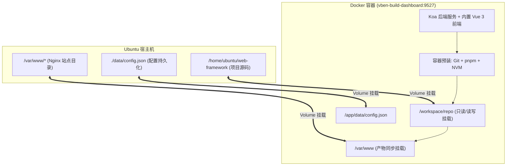

# vben-build-dashboard 运维构建与分支管理系统规格说明书

- **项目名称**：`vben-build-dashboard`
- **项目仓库**：`https://github.com/123456yzj/vben-build-dashboard.git`
- **文档状态**：完整技术规格书（v1.0 实施版）
- **更新日期**：2026-09-04
- **适用环境**：Ubuntu Server (支持宿主机原生直接运行 / Docker 一键编排部署)
- **工程定位**：**完全独立的轻量级 Node.js 运维控制台**（零侵入业务代码，解耦独立部署）
- **核心宗旨**：**极致简化打包构建与测试环境运维全流程**（告别手动切换目录、切分支拉代码、多目录拷贝产物、处理内存溢出及切换 Node/pnpm 版本的繁琐操作）

---

## 1. 背景与核心痛点

在 Ubuntu 测试服务器上进行 Monorepo / 多仓前端工程（如 Vben Admin 架构）的构建部署时，存在以下痛点：
1. **路径与分支繁琐**：每次打包前需手动 `cd apps/web-<app>` 切分支拉代码，再退回根目录打包，长期运行后服务器残留大量未清理的废弃分支。
2. **多包产物流向不一**：不同业务子包在服务器上的部署静态路径各异（如 admin 对应 `/var/www/admin`，bms 对应 `/var/www/bms`），手工拷贝繁琐且容易覆盖错误。
3. **内存突增与 OOM 风险**：多包打包时 Node 内存瞬时激增，容易导致系统卡死或触发 Linux OOM Killer 强杀构建进程，缺乏实时内存监测与硬性限额机制。
4. **依赖与缓存污染**：切分支后容易发生依赖冲突，需要便捷的依赖重新安装与 `.turbo`/`.vite`/`dist` 一键缓存深度清理。
5. **Node/pnpm 版本切换**：不同分支需求不同 Node/pnpm 版本，终端手工切换环境变量容易产生混淆。

---

## 2. 标准化系统提示词（Prompt Template - v1.0 实施版）

> **说明**：此提示词已汇集全部功能规则、交互细节、技术栈与部署约束，可直接用于驱动系统实现。

```markdown
# 角色与目标
你是一名资深 DevOps 与全栈工具开发专家。请为部署在 Ubuntu 服务器上的 Monorepo / 多仓前端项目开发一套**完全独立的轻量级 Node.js Web 控制台运维工具（vben-build-dashboard）**。
该工具的核心宗旨是**极致简化测试环境构建与环境维护全流程**，彻底免除在终端中手工切目录、切分支、退回构建、多目录拷贝产物、处理内存溢出及手动切换 Node/pnpm 版本的繁琐操作。

# 技术架构与工程形态
1. **完全解耦与独立部署**：作为一个独立的外部项目部署（在独立目录运行或通过 Docker 一键部署），零侵入业务 Monorepo 代码库。
2. **后端服务 (Koa)**：
   - 采用 Koa + @koa/router + koa-static + koa-bodyparser 构建轻量 HTTP 服务；
   - 单端口一体化托管：静态前端页面与 REST API 统一监听 `0.0.0.0:9527`（端口可配），纯内网免密访问，无需任何 Nginx 反向代理配置；
   - 基于 `ws` 库提供 WebSocket 实时日志流与系统内存指标推流；
   - 基于 Node 原生 `node:child_process` 实现非阻塞子进程调度，动态注入 `NODE_OPTIONS` 控制打包内存上限；
   - 基于 `archiver` 提供产物流式 Zip 压缩下载。
3. **前端控制台 (Vue 3 免编译单页)**：
   - 采用 Vue 3 独立运行版（`vue.global.prod.js` 本地内置，零 Vite/Webpack 构建打包流程，开箱即用，100% 离线可用）；
   - 内置 `ansi_up.js` 实现彩色终端 ANSI 转义字符渲染；
   - 现代化极简深色/浅色响应式控制台样式（卡片大盘、终端视窗、抽屉面板）。
4. **双部署模式**：
   - 模式 A（宿主机直接运行）：`npm start` 或 systemd 守护进程；
   - 模式 B（Docker 一键编排）：提供 Dockerfile 与 docker-compose.yml，通过数据卷（Volume）挂载宿主机源码目录和目标部署目录。

# 核心功能模块

## 1. 目标工程配置与监控大盘 (Dashboard)
- **目标工程配置**：支持在界面手动设置并验证 Monorepo 根路径（自动检测 package.json 与 pnpm-workspace.yaml），支持动态刷新子包。
- **业务子包监控卡片**：自动扫描 `apps/*`，展示根仓与各子包当前检出分支、最新 Commit（Hash、作者、内容、时间）及未提交的脏改动（Dirty Status）标识。

## 2. Git 分支自动化管理 (Branch Manager)
- **拉取与刷新**：一键全局或单包执行 `git fetch -p` 同步远程最新分支。
- **分支检出 (Checkout)**：
  - 单包检出：下拉框快速筛选并切换本地/远程分支。
  - 多包联动检出：顶部输入特性分支名（如 `feature/xxx`），一键将所有存在该同名分支的子包批量检出，不存在的子包自动跳过并状态提示。
- **脏工作区智能拦截 (Dirty Handling)**：
  - 检测到当前子包有未提交修改时，点击切分支主动弹出对话框：
    1. 【暂存并切换 (Git Stash & Checkout)】
    2. 【强制丢弃本地改动 (Hard Reset)】
    3. 【取消操作】
- **一键清理失效/历史分支 (Branch Prune) 与本地分支维护 (Local Branch Maintenance)**：
  - **严格仅本地分支维护**：分支维护弹窗仅扫描与操作当前机器的本地分支（`refs/heads/*`），绝不向 Git 远程仓库发起任何删除或推送（不执行 `git push --delete`）。
  - **智能状态标识**：列表清晰展示每个本地分支的详细状态徽章（当前检出、受保护、已合并、远程已删除/失效）及最近提交信息。
  - **高效筛选与批量清理**：支持关键词搜索、快速过滤已合并/失效分支、一键全选可清理分支及批量删除。
  - **一键本地清理**：提供【一键清理】按钮：自动清理所有已合并到主分支（master/main/test）的本地历史分支，以及远程已删除的本地残余分支。
  - **严格保护屏障**：当前检出分支与受保护分支白名单（`master`, `main`, `develop`, `test` 等）严格禁止在界面上被删除。

## 3. 打包构建与内存防 OOM 调度台 (Build Pipeline & Anti-OOM)
- **构建目标选择**：支持单选某个业务包单独打包、多选打包或一键【全量打包】。
- **灵活并发策略**：
  - 界面提供【允许并行打包 (Turbo)】开关：开启走 Turbo 原生多核并行构建；关闭走队列串行依次打包（平稳控制系统负载）。
- **实时内存监控**：
  - 界面实时轮询推流 Ubuntu 系统内存占用率（Total / Used / Free）以及构建进程树的实时物理内存（RSS）。
- **构建内存上限限制 (Anti-OOM)**：
  - 支持在界面或设置中配置构建内存上限（如 4096MB、8192MB），启动构建时动态注入环境变量：
    `NODE_OPTIONS="--max-old-space-size=XXXX"`
    彻底防止瞬时内存突增打爆系统 RAM 导致 OOM 崩溃。
- **实时高亮终端**：基于 WebSocket 实时推流标准输出，内置 ANSI 颜色解码、自动滚屏、清屏与耗时统计。

## 4. 产物管理、本地定向传输与网页下载 (Artifacts Management)
- **默认产物生成**：打包产物默认保留在各应用代码目录（`apps/<app>/dist`）。
- **本地多目录定向传输**：
  - 支持在设置中为每个业务包单独配置服务器本地目标路径（如 `apps/web-admin` -> `/var/www/admin`，`apps/web-bms` -> `/var/www/bms`）。
  - 打包完成后支持一键【传输至目标目录】（覆盖前自动为上一版本在目标目录生成带时间戳的备份快照），亦可开启【打包后自动传输】。
- **网页端一键下载**：各应用卡片提供【下载 Zip】按钮，后端流式压缩产物直传浏览器。

## 5. 依赖包维护与深度缓存清理 (Package & Cache Cleaner)
- **依赖安装与重装**：提供一键 `pnpm install` 与深度重装（清除 lockfile 后全量安装）。
- **缓存深度清理**：
  - 构建缓存清理：一键清理所有子包与根目录的 `.turbo`、`dist` 及 `node_modules/.vite` 缓存。
  - 深度重置：一键彻底清理项目中所有 `node_modules` 目录。

## 6. Node.js (基于 NVM) 与 pnpm 多版本管理 (Runtime Switcher)
- **Node.js 多版本管理**：
  - 对接服务器已有的 `nvm` 环境（通过 `~/.nvm/versions/node` 或 `nvm.sh`）：
  - 自动列出已安装的 Node 版本列表，支持界面切换当前项目构建生效的 Node 版本（构建子进程通过动态注入对应 Node bin 路径极速执行）。
  - 支持在界面输入版本号执行 `nvm install <version>` 安装新 Node 版本。
- **pnpm 多版本管理**：
  - 支持查看当前 pnpm 版本，支持一键切换或安装指定 pnpm 版本（通过 `corepack` 或 `npm i -g pnpm@<version>`）。

## 7. 系统配置中心 (Settings Panel)
- 可视化维护配置并持久化保存在本地 `config.json`：
  - 目标工程根目录（Target Monorepo Path）。
  - 各业务子包本地部署目标目录映射表。
  - 构建最大内存上限（Max Old Space Size，默认 8192MB）。
  - 保护分支白名单列表。
  - 当前选定的 Node 与 pnpm 运行版本。
  - 默认构建模式偏好（开发/生产、并行/串行）。
```

---

## 3. 技术架构与双运行模式

### 3.1 宿主机直接运行模式 (Host Native Mode)

```mermaid
flowchart LR
    Dev[开发者浏览器] <==>|0.0.0.0:9527 (HTTP + WS)| KoaApp[Koa 服务端 (Node.js)]
    KoaApp --> Static[托管 public 静态单页 (Vue3)]
    KoaApp --> GitSub[原生 child_process: Git / pnpm / nvm]
    GitSub --> Monorepo[目标 Monorepo 项目]
    Monorepo --> Dist[apps/*/dist 产物]
    Dist --> LocalDeploy[本地定向同步: /var/www/*]
```

### 3.2 Docker 一键部署模式 (Docker Compose Volume Mount Mode)



---

## 4. Docker 部署文件定义

### 4.1 `Dockerfile`
```dockerfile
FROM node:20-bookworm-slim

WORKDIR /app

# 安装 Git、rsync、curl 及编译必须的基础工具
RUN apt-get update && apt-get install -y --no-install-recommends \
    git \
    rsync \
    curl \
    ca-certificates \
    procps \
    && rm -rf /var/lib/apt/lists/*

# 全局安装 pnpm
RUN npm install -g pnpm@latest

# 安装 NVM 支持多版本 Node
ENV NVM_DIR=/root/.nvm
RUN curl -o- https://raw.githubusercontent.com/nvm-sh/nvm/v0.39.7/install.sh | bash

# 复制工具依赖定义与源码
COPY package.json package-lock.json* pnpm-lock.yaml* ./
RUN npm install --production

COPY . .

EXPOSE 9527
ENV HOST=0.0.0.0
ENV PORT=9527

CMD ["node", "server.mjs"]
```

### 4.2 `docker-compose.yml`
```yaml
version: '3.8'

services:
  vben-build-dashboard:
    build: .
    container_name: vben-build-dashboard
    restart: unless-stopped
    ports:
      - "9527:9527"
    environment:
      - HOST=0.0.0.0
      - PORT=9527
      - TARGET_REPO_PATH=/workspace/repo
    volumes:
      # 1. 宿主机被管理的 Monorepo 目录
      - ${HOST_REPO_PATH:-/home/ubuntu/web-framework}:/workspace/repo
      # 2. 宿主机各业务包部署的目标根目录（如 /var/www）
      - ${HOST_DEPLOY_PATH:-/var/www}:/var/www
      # 3. 持久化数据与配置
      - ./data:/app/data
```

---

## 5. 项目完整目录结构

```text
vben-build-dashboard/
├── docs/                      # 项目设计规格文档
│   └── SPEC.md                # 完整技术规格书 (本文件)
├── public/                    # 前端单页 Web 控制台（免构建，即改即生效）
│   ├── index.html             # 核心单页 HTML（卡片大盘、终端视窗、抽屉面板）
│   ├── app.js                 # Vue 3 核心业务交互逻辑
│   ├── style.css              # 现代化终端控制台视觉样式
│   └── vendor/                # 离线单文件静态依赖（无需连外网 CDN）
│       ├── vue.global.prod.js # Vue 3 官方独立免编译运行时
│       └── ansi_up.js         # ANSI 转义字符高亮解析器
├── server.mjs                 # Koa 后端入口与主服务
├── lib/                       # 后端业务逻辑模块
│   ├── config.mjs             # 配置管理（读取/更新 config.json）
│   ├── git.mjs                # Git 调度器（分支扫描/检出/暂存/清理）
│   ├── build.mjs              # 构建流水线调度（Turbo/pnpm 执行与内存上限注入）
│   ├── monitor.mjs            # 系统内存与进程 RSS 实时轮询
│   ├── nvm.mjs                # NVM 版本与 pnpm 版本桥接
│   └── sync.mjs               # 产物本地定向传输与自动备份
├── config.example.json        # 配置文件模板
├── Dockerfile                 # Docker 镜像构建文件
├── docker-compose.yml         # Docker Compose 一键启动配置
├── package.json               # Koa 与运行时依赖定义
├── README.md                  # 项目使用与部署说明
└── start.sh                   # Ubuntu 宿主机一键启动脚本
```

---

## 6. 变更历史与维护记录

| 日期 | 版本 | 修改说明 | 操作人 |
| :--- | :--- | :--- | :--- |
| 2026-09-04 | v0.1.0 ~ v0.4.0 | 完成多轮需求讨论、明确独立工程定位与核心宗旨 | AI Pair |
| 2026-09-04 | v0.5.0 ~ v0.6.0 | 扩充多包定向传输、内存监控防OOM、NVM原生集成 | AI Pair |
| 2026-09-04 | v1.0.0 | 确定 Koa 后端架构、补充完整 Docker 一键部署编排规格，正式落库 | AI Pair |
